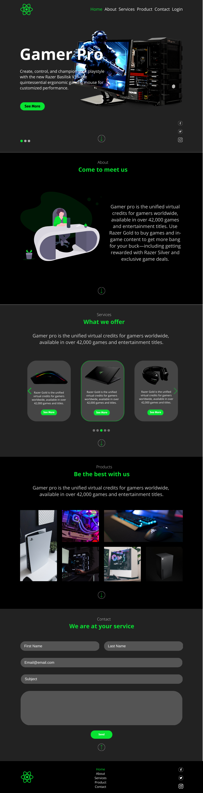
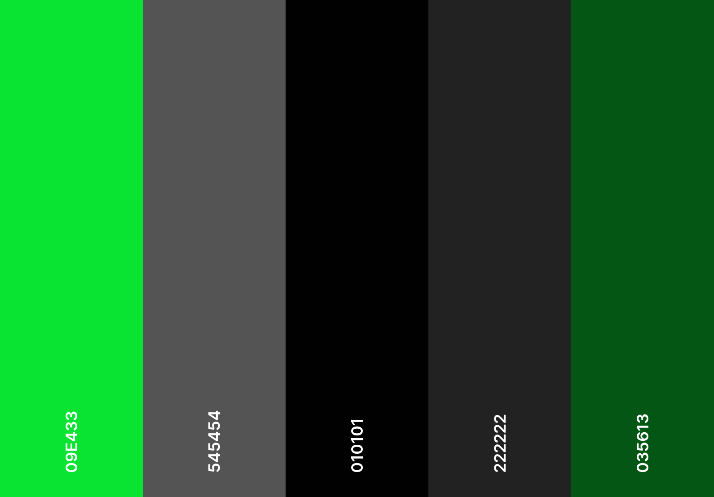

## Reactjs Vite@react Website with tailwind [(Base version)]

> Note1 - before you start contributing check Tailwind.config and index.css for basic config.

> Note2 - site design will be dynamic responding to future changes through a db, for now we will use a data file to store all the variable or non-static data of the page.

| [Covered Content](https://github.com/JailsonA/) |
| ----------------------------------------------- |
| **React**                                       |
| ✓ HTML                                          |
| ✓ CSS                                           |
| ✓ JSX                                           |
| ✓ Components                                    |
| ✓ React-icons                                   |
| ✓ @heroicons                                    |
| ✓ useState & useEffect                          |
| ✓ Frame-motion                                  |
| ✓ React-scroll                                  |
| ✓ Swiperjs                                      |
| ✓                                               |

## Getting started

- Recommended `node js 16.x` and `npm 6+`. (suggestion v16.15.0)
- Install dependencies: `npm install` / `yarn install`
- Install react-icons: `npm install react-icons`
- install @heroicons: `npm i @heroicons/react --save` / `npm i @heroicons/react@v1`
- install Frame-motion: `npm i framer-motion --save`
- install React-scroll: `npm i react-scroll --save`
- install Swiperjs: `npm i swiper --save`
- Start the project: `npm run start` / `yarn start`

 

## Website Preview

 

## Colors Palette

> all colors are configured in Tailwind.config.

